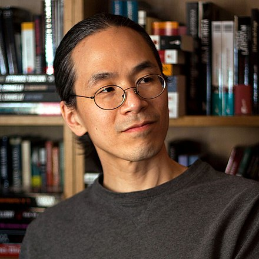
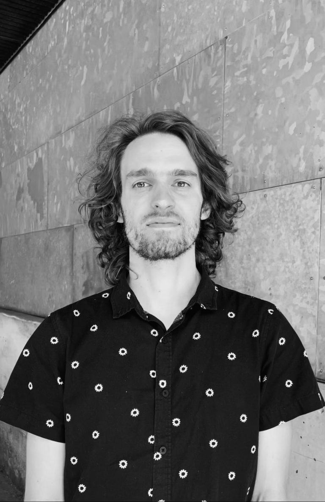

Welcome to the **Generative AI and Creativity** workshop at [NeurIPS 2024](https://neurips.cc/) (December 14/15 in Vancouver, Canada)!
This workshop aims to bridge the gap between AI researchers and creative professionals, fostering mutual understanding and collaboration to address the impact of generative AI on creative fields.

The rapid advancement of generative AI technology has significantly affected various creative professions, from writing and visual art to music and performing arts. High-profile events such as the New York Times lawsuit against OpenAI and the Writers Guild of America and SAG-AFTRA strike against Hollywood highlight the disconnect between AI developers and creative professionals. This workshop seeks to address this disconnect by fostering dialogue and collaboration between these communities.

The transformative potential of generative AI will only be fully realized when AI researchers gain a deeper understanding of the creative processes of human artists and develop constructive partnerships based on that understanding. This workshop aims to create such connections.

The workshop will cover a broad range of topics, including:

- Design of interactive, human-in-the-loop generative AI systems
- Detection of plagiarism and copying in image and text generation
- Tools to protect content creators from unwanted training
- Representational biases in training data and their effects
- Detection of AI-generated content and methods of evading detection
- Benchmarking "creativity" in generative AI systems
- Theories of data governance, provenance, and leverage
- Proposals for data licensing for AI training, especially for creative applications
- Surveys of attitudes and practices of creative professionals regarding generative AI
- Discussion of generative AI from legal, ethical, economic, or other perspectives

The workshop will also showcase artwork that critically engages with the use of AI in creative endeavors and sparks conversations about our relationship with AI.

---

## **Important Dates** {#dates}

| **Event**           | **Date** |
| ------------------- | -------- |
| Submission Deadline | TBD      |
| Final Decisions     | TBD      |
| Workshop Date       | TBD      |

---

## **Schedule** {#schedule}

The following schedule is tentative and will be confirmed closer to the workshop:

|    **Time** | **Topic**                    | **Speaker(s)/Presenter(s)** |
| ----------: | :--------------------------- | :-------------------------- |
|   9:00-9:15 | Intro                        |                             |
|   9:15-9:45 | Invited Talk 1               | TBD                         |
|  9:45-10:15 | Invited Talk 2               | TBD                         |
| 10:15-10:45 | In Conversation              | TBD                         |
| 10:45-11:00 | Coffee Break                 |                             |
| 11:00-11:15 | Contributed Talk 1           | TBD                         |
| 11:15-11:30 | Contributed Talk 2           | TBD                         |
| 11:30-11:45 | Contributed Talk 3           | TBD                         |
| 11:45-12:00 | Contributed Talk 4           | TBD                         |
| 12:00-14:00 | Lunch Break & Poster Session |                             |
| 14:00-14:30 | Invited Talk 3               | TBD                         |
| 14:30-15:00 | Invited Talk 4               | TBD                         |
| 15:00-15:30 | Invited Talk 5               | TBD                         |
| 15:30-16:00 | Coffee Break                 |                             |
| 16:00-17:00 | Panel Discussion             | TBD                         |
| 17:00-18:00 | Round Table Discussions      | TBD                         |

---

## **Keynote Speakers** {#speakers}

    <figure>
        
        <b> <a href="https://en.wikipedia.org/wiki/Ted_Chiang">Ted Chiang</a>
         Science Fiction Writer</b>
    </figure>

<a href="https://en.wikipedia.org/wiki/Ted_Chiang"><b>Ted Chiang</b></a> is an American science fiction writer. His work has won four Nebula awards, four Hugo awards, the John W. Campbell Award for Best New Writer, and six Locus awards. He has published the short story collections Stories of Your Life and Others (2002) and Exhalation: Stories (2019). His short story "Story of Your Life" was the basis of the film Arrival (2016). He is also a technical writer and frequent non-fiction contributor to the New Yorker Magazine, especially on topics in computing such as artificial intelligence. Photo credit: <a href="https://www.flickr.com/photos/arturovillarrubia/5494916110/">Arturo Villarrubia</a>

    <figure>
        
        <b> <a href="https://czhuang.github.io/">Anna Huang</a>
         Research Scientist Google DeepMind</b>
    </figure>

<a href="https://czhuang.github.io/"><b>Anna Huang</b></a>
is currently a Research Scientist at Magenta in Google DeepMind, focusing on generative models and human-AI partnerships in music creation. She created the ML model Coconet, which powered Google's first AI Doodle, the Bach Doodle, harmonizing 55 million melodies in two days. In 2018, she developed Music Transformer, a pioneering model for generating music with long-term structure, and the first successful adaptation of the transformer architecture to music. Her ICLR paper on Music Transformer is the most cited in music generation. She holds a Canada CIFAR AI Chair at Mila and serves as an adjunct professor at the University of Montreal. She has been involved in the AI Song Contest as a judge and organizer from 2020-2022. Her research interests include designing generative AI with an interaction-driven approach to enhance how we understand, learn, and create music. She collaborates with musicians to tailor AI systems to their creative practices, focusing on interpretability, explainability, and social reinforcement learning. She envisions interactive systems where musicians and AI can co-create, fostering creativity through interaction rather than imitation.

---

## **Panelists** {#panelists}

TBD

---

## **Organizers** {#organizers}

<figure>
  <a>Yaim Cooper</a>
</figure>

<figure>
	
    <b> <a href="https://holdenlee.github.io/">
	Holden Lee (He/They)</a>
     Assistant Professor Johns Hopkins University</b>
</figure>
    
<figure>
    
    <b> <a href="https://unesco-studio.umontreal.ca/team/hugo_berard.html">Hugo Berard (He/Him)</a>
     Postdoc Chaire UNESCO en Paysage Urbain, Université de Montréal </b>
</figure>

---

## **Call for Papers and Creative Work** {#call}

**Please check back soon for the submission portal.**

### Call for Papers

We invite participants to submit 2-page papers in the NeurIPS camera-ready format (with author names visible) at our submission portal by 11:59pm **August 29**, AoE. References and any supplementary materials provided do not count as part of the 2-page limit. However, it will be at the reviewers’ discretion to read the supplementary materials.

We invite both technical contributions related to building tools aligned with the values and needs of creative professionals, as well as perspectives on broader issues in the field. See the workshop description above for a (non-exhaustive) list of topics.

At least one author of each accepted paper must register for and attend the workshop. Submissions cannot have previously appeared in conferences or journals, including the main NeurIPS conference. Accepted papers will appear on the workshop website, but the workshop will not have official proceedings.

### Call for Creative Work

We invite creative submissions of all forms, including (and not limited to) visual art, writing, music, film, mathematics, and performance, that critically engage with the use of AI in creative endeavors. The work itself can be generated with or without AI tools, and can be “proof-of-concept”.
We especially look for work that puts generative AI in context within the creative process, shows new ways of collaborating creatively with AI, and sparks conversation about our relationship with AI. Artwork will be judged based on both artistic merit and on thematic relevance.
Submit at our submission portal by 11:59pm **August 29**, AoE. 

While registration is required to attend the workshop, it will not be required to have accepted artwork.

If your work is selected for inclusion in the program, you grant us non-exclusive rights to publish and reproduce the artwork. By submitting, you affirm that you are the author of the work and have the authority to grant these rights.
Please indicate whether the work has previously appeared in other venues (including online) or is currently being reviewed elsewhere. We will prioritize original submissions which have not previously appeared in other venues.

Submissions should consist of the following, placed within a single .zip folder:

- Required: At least one of the following
	- A single file consisting of the artwork, named `artwork_name_main` (with appropriate file extension).
	- For works that are not film, you may submit a video of at most 1 minute demonstrating the artwork, named `artwork_name_video.mp4`; we recommend this for works that cannot easily be presented electronically, for example, a physical interactive experience.
- Required: A description to accompany the artwork, in the same format as in the call for papers. This should include the title and artist bios. This can include a description of the creation process or discussion of themes, and will be taken into account when evaluating the submission.
- Optional: You may submit additional files named `artwork_name_supplementary_1`, `artwork_name_supplementary_2`, etc. Note that the submission will primarily be judged by the merit of the main piece, and we will include any supplementary work in the program at our discretion.

If you are not able to submit your piece conforming to the above format, please get in touch with us with a description of your work, and we can arrange an alternative way for you to submit. For example, we may ask you to submit a link if it is an interactive piece hosted on a web server. Submissions not adhering to the above guidelines will be accepted only when cleared with us.

---

## **Contact** {#contact}

Contact the organizers at [creativity.ai.neurips@gmail.com](mailto:creativity.ai.neurips@gmail.com)
