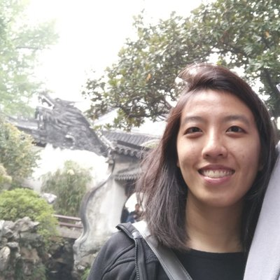
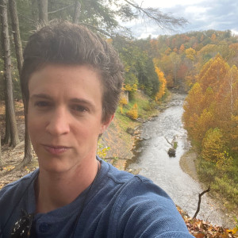
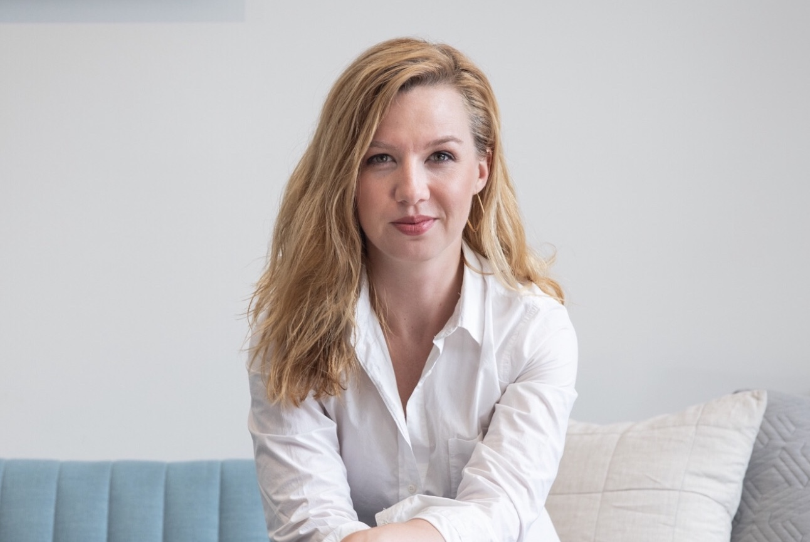
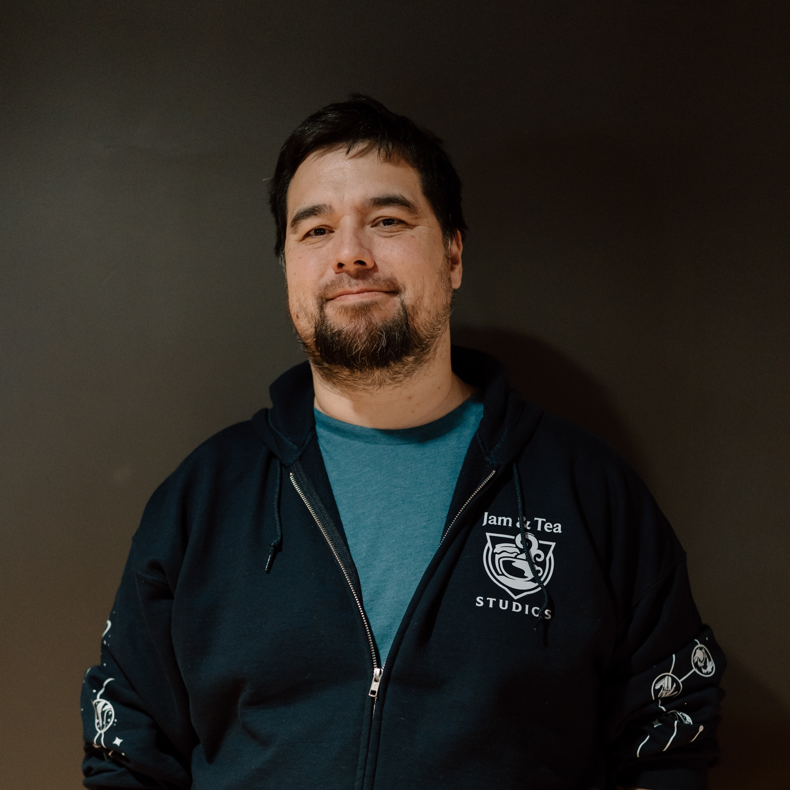
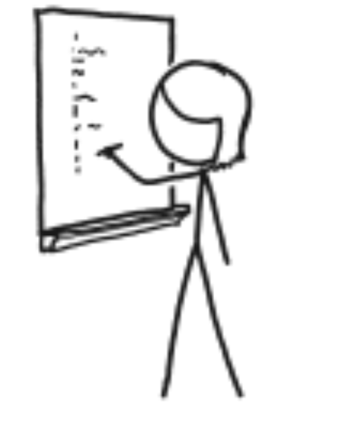
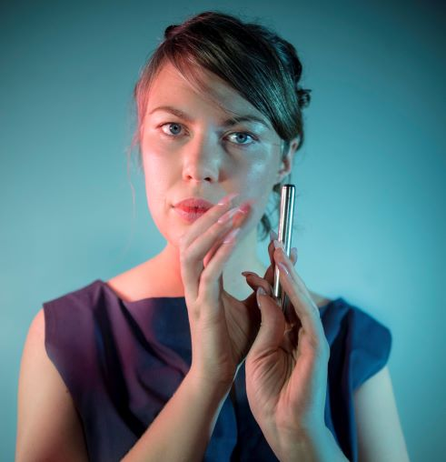

<!-- We are happy to announce the inaugural [NeurIPS 2024](https://neurips.cc/) workshop. In the wake of a disruptive year of advances in generative AI, we are bringing together the two communities for much-needed conversation. This will provide a forum to voice the concerns and proposals of creative professionals, foster mutual understanding and collaboration, and jump-start initiatives to empower them. -->

Join us for the 2024 Workshop on **Creativity & Generative AI: A dialogue between machine learning researchers and creative professionals**. In the wake of a disruptive year of advances in generative AI, we are bringing together the two communities for much-needed conversation.

We will provide a forum to voice the concerns and proposals of creative professionals, highlight existing efforts and jump-start new initiatives to empower creative communities, and foster mutual understanding and collaboration. Speakers and participants will include people who have a technical background in machine learning, as well as creative professionals who can speak to their experiences with generative AI.

<!-- Welcome to the **Generative AI and Creativity** workshop at [NeurIPS 2024](https://neurips.cc/) (December 14 or 15 in Vancouver, Canada)!
This workshop aims to bridge the gap between AI researchers and creative professionals, fostering mutual understanding and collaboration to address the impact of generative AI on creative fields. -->

<!-- The rapid advancement of generative AI technology has significantly affected various creative professions, from writing and visual art to music and performing arts. High-profile events such as the New York Times lawsuit against OpenAI and the Writers Guild of America and SAG-AFTRA strike against Hollywood highlight the disconnect between AI developers and creative professionals. This workshop seeks to address this disconnect by fostering dialogue and collaboration between these communities.

The transformative potential of generative AI will only be fully realized when AI researchers gain a deeper understanding of the creative processes of human artists and develop constructive partnerships based on that understanding. This workshop aims to create such connections. -->

The workshop will include:

- papers, posters, and talks with technical contributions and broader perspectives
- exhibition of artwork that critically engages with the use of AI in creative endeavors and sparks conversations about our relationship with AI
- panels and round table discussions to foster mutual understanding and collaboration.

The workshop is co-located with the NeurIPS 2024 conference, a large annual AI conference, and will take place in Vancouver, Canada.

---

## **Important Dates** {#dates}

| **Event**           | **Date**                 |
| ------------------- | ------------------------ |
| Submission Deadline | September 12, 2024       |
| Final Decisions     | October 9, 2024          |
| Workshop Date       | December 14 and 15, 2024 |

---

## **Schedule** {#schedule}

The following schedule is tentative and will be confirmed closer to the workshop:

### Saturday

|    **Time** | **Topic**                      | **Speaker(s)/Presenter(s)**                             | **Location**                |
| ----------: | :----------------------------- | :------------------------------------------------------ | :-------------------------- |
|   8:45-9:00 | Intro / Opening Remarks        |                                                         | 201 room (NeurIPS) + Online |
|   9:00-9:30 | Invited Talk                   | Anna Huang                                              | 201 room (NeurIPS) + Online |
|  9:30-10:00 | Coffee Break                   |                                                         | 201 room (NeurIPS)          |
| 10:00-10:30 | Invited Talk                   | Kelly McKernan                                          | 201 room (NeurIPS) + Online |
| 10:30-11:15 | Pannel on AI & Copyright       | A. Feder Cooper, Edward Lee, Ben Brooks, Jillian Arnold | 201 room (NeurIPS) + Online |
| 11:15-11:45 | Contributed Talks              |                                                         | 201 room (NeurIPS) + Online |
| 11:45-13:00 | Lunch Break                    |                                                         |                             |
| 13:00-14:00 | Poster Session                 |                                                         | 201 room (NeurIPS)          |
| 14:00-14:15 | Break / Move to Pinnacle Hotel |                                                         |                             |
| 14:15-14:45 | Invited Talk                   | Ted Chiang                                              | Pinnacle Hotel + Online     |
| 14:45-15:15 | Coffee Break                   |                                                         | Pinnacle Hotel              |
| 15:15-15:30 | Icebreaker                     |                                                         | Pinnacle Hotel + Online     |
| 15:30-16:00 | Mini Talks                     | Carl Kwoh, Jingna Zhang                                 | Pinnacle Hotel + Online     |
| 16:00-17:30 | Round Table Discussions        |                                                         | Pinnacle Hotel + Online     |
| 17:30-17:45 | Closing Remarks                |                                                         | Pinnacle Hotel + Online     |
| 17:45-19:30 | Dinner                         |                                                         | Pinnacle Hotel              |

### Sunday

|   **Time** | **Topic**                    | **Speaker(s)/Presenter(s)** | **Location**   |
| ---------: | :--------------------------- | :-------------------------- | :------------- |
| 9:00-14:00 | Detailed schedule to come... |                             | Pinnacle Hotel |

---

## **Keynote Speakers** {#speakers}

    <figure class="w-1/3">
        
        <b> <a href="https://en.wikipedia.org/wiki/Ted_Chiang" class="text-main">Ted Chiang</a>
         Writer</b>
    </figure>

<a href="https://en.wikipedia.org/wiki/Ted_Chiang"><b>Ted Chiang</b></a> is an American science fiction writer. His work has won four Nebula awards, four Hugo awards, the John W. Campbell Award for Best New Writer, and six Locus awards. He has published the short story collections Stories of Your Life and Others (2002) and Exhalation: Stories (2019). His short story "Story of Your Life" was the basis of the film Arrival (2016). He is also a technical writer and frequent non-fiction contributor to The New Yorker magazine, especially on topics in computing such as artificial intelligence.

    <figure class="w-1/3">
        
        <b> <a href="https://czhuang.github.io/" class="text-main">Anna Huang</a>
         Computer Science Google DeepMind</b>
    </figure>

<a href="https://czhuang.github.io/"><b>Anna Huang</b></a>
is a Research Scientist at Magenta in Google DeepMind, specializing in generative models and human-AI partnerships in music creation. She developed Coconet, powering Google's first AI Doodle, and Music Transformer, a pioneering model for long-term music generation. She holds a Canada CIFAR AI Chair at Mila, serves as an adjunct professor at the University of Montreal, and has been involved in the AI Song Contest. Her research focuses on designing interactive generative AI systems to enhance music creation, emphasizing interpretability, explainability, and social reinforcement learning.

    <figure class="w-1/3">
        
        <b> A. Feder Cooper</b>
    </figure>

<b>A. Feder Cooper</b> is a scalable machine-learning (ML) researcher, co-founder of The GenLaw Center, and an incoming Professor of Computer Science at Yale University. Cooper's contributions span uncertainty estimation, privacy and security of generative-AI systems, distributed training, hyperparameter optimization, and model selection. Cooper also does work in tech policy and law, and spends a lot of time finding ways to effectively communicate the capabilities and limits of AI/ML to interdisciplinary audiences and the public

    <figure class="w-1/3">
        
        <b>  Ben Brooks</b>
    </figure>

<b>Ben Brooks</b> is a Fellow at the Berkman Klein Center, Harvard, where he scrutinizes the regulatory and legislative response to AI models. Previously, he served as Head of Public Policy for Stability AI, custodian of Stable Diffusion, and drove regulatory development efforts at GoogleX, Uber, and Coinbase, working with authorities on the ground in over 25 countries.

    <figure class="w-1/3">
        
        <b> Edward Lee</b>
    </figure>

Professor <b>Edward Lee</b> is a professor at Santa Clara Law and the founder of ChatGPTiseatingtheworld.com. His current research focuses on the ways in which AI, blockchain, and other disruptive technologies challenge existing legal paradigms.

    <figure class="w-1/3">
        
        <b> Jillian Arnold</b>
    </figure>

<b>Jillian Arnold</b> is a recording and workflow engineer for live tv (Emmys, VMAs, Oscars etc). She is the president of local 695 - sound, video and projection and the IATSE AI negotiations subcommittee chair. 

    <figure class="w-1/3">
        
        <b> Jingna Zhang</b>
    </figure>

<b>Jingna Zhang</b> is the founder of Cara, a social and portfolio-sharing app for artists and fans with more than a million users in its beta. Prior to Cara, Jingna was an award-winning fashion and fine art photographer for magazines like Vogue, Elle, and Harper’s Bazaar, the founder of an esports team in StarCraft II, and a Singapore Olympic team candidate in air rifle. She works at the intersection of art and technology, advocating for creative rights and responsible AI development.

    <figure class="w-1/3">
        
        <b> Carl Kwoh</b>
    </figure>

<b>Carl Kwoh</b> is CEO of Jam & Tea Studios, making games with generative ai as an engine for Improvisational Play between players. He's worked in the games industry for 20+ years at companies like Riot Games, Popcap Games, and Phoenix Labs

---

## **Accepted papers** {#papers}

- [Deepfake Detection using Parallel Vision Transformers](assets/papers/5.pdf)
- [Rethinking Artificial Intelligence creativity and ideation systems](assets/papers/12.pdf)
- [Alien Recombination: Exploring Concept Compositions Beyond Human Cognitive Availability in Visual Art](assets/papers/16.pdf)
- [FicSim: An Ethically Constructed Dataset for Long-Context Semantic Similarity Comparison within Fiction](assets/papers/21.pdf)
- [Composers’ Evaluations of an AI Music Tool: Insights for Human-Centered Design](assets/papers/23.pdf)
- [Copiloting Creative 3D Scene Modeling and Visualization with Generative Agents](assets/papers/39.pdf)
- [My Voice, Your Voice, Our Voice: Attitudes Towards Collective Governance of a Choral AI Dataset](assets/papers/41.pdf)
- [Narrative Information Theory](assets/papers/42.pdf)
- [Collaborative Creativity – Sparking Human Creativity in Brainstorming Sessions with an AI Muse](assets/papers/45.pdf)
- [Show, Don’t Tell: Uncovering Implicit Character Portrayal using LLMs](assets/papers/46.pdf)
- [Denoising Monte Carlo Renders with Diffusion Models](assets/papers/48.pdf)
- [Autolume: A GAN-based No-Code AI Tool for Art Creation](assets/papers/49.pdf)
- [PDMX: A Large-Scale Public Domain MusicXML Dataset for Symbolic Music Processing](assets/papers/53.pdf)
- [Automated Black-box Prompt Engineering for Personalized Text-to-Image Generation](assets/papers/54.pdf)
- [Real-Time Neuro-Augmented Cinema via Generative AI](assets/papers/55.pdf)
- [Iterative Optimization of SDS Loss for Video Generation from Multi-Object Sketches](assets/papers/56.pdf)
- [Localized Text-to-Image Generation For Free via Cross Attention Control](assets/papers/58.pdf)
- [An Object is Worth 64x64 Pixels: Generating 3D Object via Image Diffusion](assets/papers/62.pdf)
- [Musical Agent Systems: MACAT and MACataRT](assets/papers/64.pdf)
- [Steering LLMs to Evaluate and Amplify Creativity](assets/papers/67.pdf)
- [ComicCamp: A Framework for Comic-Style Campaign Narration](assets/papers/70.pdf)

---

## **Accepted artworks** {#artworks}

- [GoGo Musebots: Generative Music for Robotic Instruments and Human performers](assets/artworks/3.pdf)
- [Spectra](assets/artworks/6_description.pdf)
- [mind-meld](assets/artworks/8_description.pdf)
- [La Solitudine delle Moltitudini (The Solitude of the Multitudes)](assets/artworks/9.pdf)
- [Regenerate](assets/artworks/10_main.pdf) (see [description](assets/artworks/10_description.pdf))
- [Forrest Dance](assets/artworks/13_description.pdf)
- [Dreaming Species](assets/artworks/15.pdf)
- [Immaculate Conception Inc.: A Journey Through the Future of Birth](assets/artworks/24_main.png) (see [description](assets/artworks/24_description.pdf))
- [The Tale of Punyakoti: An AI-Enhanced Audio Experience](assets/artworks/29_description.pdf)
- [Walter Benjamin’s The Destructive Character AI-fication](assets/artworks/47_main.pdf) (see [description](assets/artworks/47_description.pdf))
- [Typologies](assets/artworks/51_main.pdf) (see [description](assets/artworks/51_description.pdf))
- [Ecotones of the Mind](assets/artworks/60_description.pdf)
- [Elyra Vunaris Presents the Music of Varexia](assets/artworks/65_description.pdf)
- [Revival: Collaborative Artistic Creation through Human-AI Interactions in Musical Creativity](assets/artworks/66.pdf)
- [Navigating Neural Fields with Vision-Language Models](assets/artworks/69_description.pdf)

---

## **Organizers** {#organizers}

<figure>
    
    <b> <a href="https://math.nd.edu/people/faculty/yaim-cooper/" class="text-main">Yaim Cooper</a>
     Mathematics
     University of Notre Dame</b>
</figure>

<figure>
	
    <b> <a href="https://holdenlee.github.io/" class="text-main">
	Holden Lee</a>
     Applied Mathematics and Statistics
     Johns Hopkins University</b>
</figure>
    
<figure>
    
    <b> <a href="https://unesco-studio.umontreal.ca/team/hugo_berard.html" class="text-main">Hugo Berard</a>
     Computer Science
     UNESCO Chair in Urban Landscape, University of Montréal </b>
</figure>

---

## **Advisors** {#advisors}

<figure>
    
    <b> <a href="https://kenliu.name/" class="text-main">Ken Liu</a>
     Writer</b>
</figure>

<figure>
    
    <b> <a href="https://www.nickmvincent.com/" class="text-main">Nicholas Vincent</a>
     Computer Science
     Simon Fraser University</b>
</figure>

<figure>
    
    <b> <a href="https://eringee.net/" class="text-main">Erin Gee</a>
     Music
     University of Montréal</b>
</figure>

---

## **Call for Papers and Creative Work** {#call}

The submission portal for both calls is [here](https://cmt3.research.microsoft.com/CREATIVITYAI2024).

### Call for Papers

We invite participants to submit 2-page papers in the [NeurIPS camera-ready format](https://neurips.cc/Conferences/2024/CallForPapers) (with author names visible) at our submission portal by 11:59pm **September 12**, AoE. References and any supplementary materials provided do not count as part of the 2-page limit. However, it will be at the reviewers’ discretion to read the supplementary materials.

We invite both technical contributions related to building tools aligned with the values and needs of creative professionals, as well as perspectives on broader issues in the field. Here is a non-exhaustive list of topics:

- Design of interactive, human-in-the-loop generative AI systems
- Detection of plagiarism and copying in image and text generation
- Tools to protect content creators from unwanted training
- Representational biases in training data and their effects
- Detection of AI-generated content and methods of evading detection
- Benchmarking "creativity" in generative AI systems
- Theories of data governance, provenance, and leverage
- Proposals for data licensing for AI training, especially for creative applications
- Surveys of attitudes and practices of creative professionals regarding generative AI
- Discussion of generative AI from legal, ethical, economic, or other perspectives

At least one author of each accepted paper must register for and attend the workshop. Authors of accepted papers are invited to present a poster on their work in the poster session. A small number of papers may be selected for an invited talk.

Submissions that have appeared in the main NeurIPS 2024 conference are allowed. Otherwise, submissions cannot have previously appeared in conferences or journals. Accepted papers will appear on the workshop website, but the workshop will not have official proceedings.

### Call for Creative Work

We invite creative submissions of all forms, including (and not limited to) visual art, writing, music, film, games, mathematics, and performance, that critically engage with the use of AI in creative endeavors. The work itself can be generated with or without AI tools, and can be “proof-of-concept”.
We especially look for work that puts generative AI in context within the creative process, shows new ways of collaborating creatively with AI, and sparks conversation about our relationship with AI. Artwork will be judged based on both artistic merit and on thematic relevance.
Submit at our submission portal by 11:59pm **September 12**, AoE.

While registration is required to attend the workshop, it will not be required to have accepted artwork. A small number of creators may be selected to give an invited talk.

If your work is selected for inclusion in the program, you grant us non-exclusive rights to publish and reproduce the artwork. By submitting, you affirm that you are the author of the work and have the authority to grant these rights (inasmuch as possible given possible AI-assisted creation).

All submissions will be considered for a up to $200 prize to recognize outstanding contributions to the exploration of AI in art.

Please indicate whether the work has previously appeared in other venues (including online) or is currently being reviewed elsewhere. We will prioritize original submissions which have not previously appeared in other venues.

Submissions should consist of the following, placed within a single .zip folder of at most 100MB:

- Required: At least one of the following
  - A single file consisting of the artwork, named `artwork_name_main` (with appropriate file extension). (Replace `artwork_name` with the title of the piece.)
  - For works that are not film, you may submit a video of at most 1 minute demonstrating the artwork, named `artwork_name_video.mp4`; we recommend this for works that cannot easily be presented electronically, for example, a physical interactive experience.
- Required: A description to accompany the artwork of at most 2 pages, named `artwork_name_description.pdf`. We recommend using the same format as in the call for papers. The description should include the title, artist bios, and **how AI was used in the creation of the work (if it was used)**. This can include a description of the creation process or discussion of themes, and will be taken into account when evaluating the submission.
- Optional: You may submit additional files named `artwork_name_supplementary_1`, `artwork_name_supplementary_2`, etc. Note that the submission will primarily be judged by the merit of the main piece, and we will include any supplementary work in the program at our discretion.

If you are not able to submit your piece conforming to the above format, please get in touch with us with a description of your work, and we can arrange an alternative way for you to submit. For example, we may ask you to submit a link if it is an interactive piece hosted on a web server. Submissions not adhering to the above guidelines will be accepted only when cleared with us.

---

## **Contact** {#contact}

Contact the organizers at [creativity.ai.neurips@gmail.com](mailto:creativity.ai.neurips@gmail.com)
